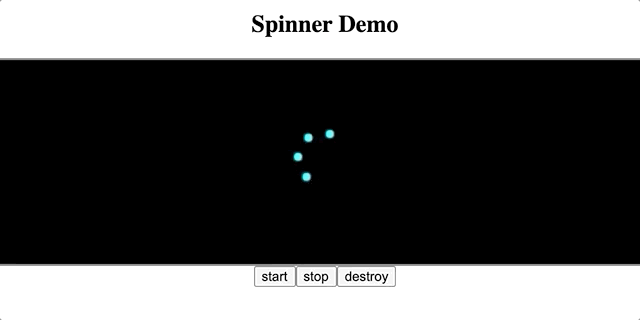
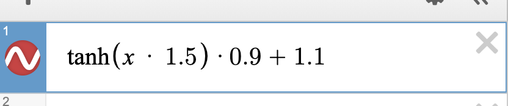
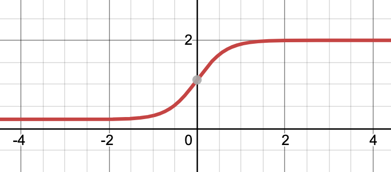

# spinner

### how to use: 
call the spinner function and pass in a reference to your container element as the parent 
for the spinner canvas to attach too,
store a reference to the returned spinnerApiObject into a variable,
now call the following methods to start, pause, resume and destroy the spinner.

- .start() start or resume (if previously stopped) the spinner
- .stop() stop/pause the spinner
- .destroy() this performs clean-up, by clearing all timers and removing the child canvas element from the DOM

### TODO: 
- make animation of spin speed-up and slow-down smoother by adjusting the trigonometry formula/function to this:

Desmos graphing calculator was used to find/figure out the formula for the graph function I need.

- wrap up into a react component or custom hook